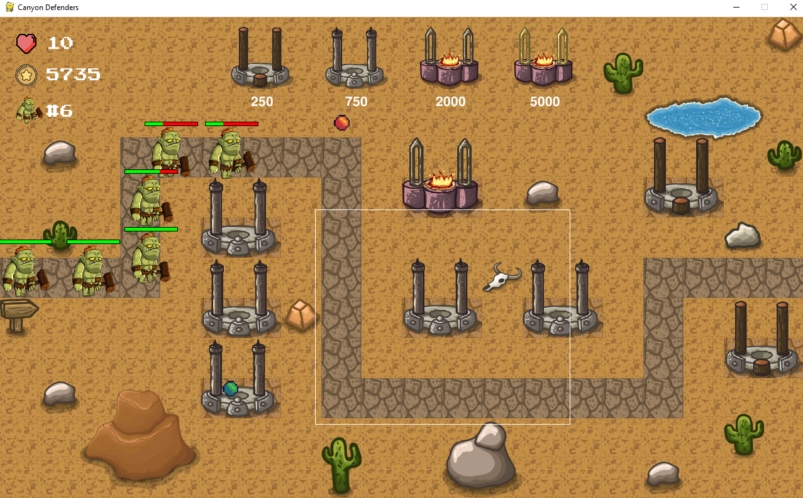

# 오픈소스 소프트웨어 실습 personal project phase1

# 참고 사이트
1) https://github.com/pygame/pygame "pygame"
2) https://github.com/mustafa-mun/canyon-defenders

# Canyon Defenders
Canyon Defenders is a tower defense game where you must defend your canyon from waves of enemies. You have 15 waves to survive, and you can use four different types of towers to help you. You can drag and drop towers to place them, and you can drag and drop new towers to upgrade existing towers

## Screenshot



## 게임 설명
### 게임 플레이 방법

- 타워를 마우스로 끌어와서 맵에 배치하면된다.
- 타워를 클릭하여 업그레이드 할 수도 있고 원래있던 타워자리에 새로운 타워를 배치할 수도 있다.
- 타워를 적절히 사용하여 모든 좀비들을 막아내면 된다.
- 15웨이브를 버티면 승리한다.

## 게임 세부내용 설명
### 타워
- 게임에 4종류의 타워가 있다.
- 각각의 타워는 공격력, 공격범위 같은 것이 다르며 비쌀수록 능력치가 더 좋다.
- 타워를 놓으면 그 타워가 어디까지 공격 가능한지 알수 있다.
- 타워를 업그레이드 하면 성능을 올릴 수 있다.

### 게임 스탯

- `Health:` 남은 목숨을 나타내며 좀비 하나가 통과할 때 마다 체력이 1 감소한다
- `Money:` 타워 건설에 필요한 돈이다.
- `Wave Number:` 지금 몇번째 웨이브인지 보여준다

## 점수판
- 게임이 끝나면 자신의 이름을 입력할 수 있다.
- Score 버튼을 통해 자신이 몇 등인지 확인할 수 있다.

## 실행방법

Clone the project

```bash
  git clone https://github.com/keelle/oss_personal_project_phase1
```

Go to the project directory

```bash
  cd canyon-defenders
```

Install PyGame

```bash
  python3 -m pip install -U pygame --user
```

Start game

```bash
  python3 game.py
```

## 실행 화면

## 코드 설명

